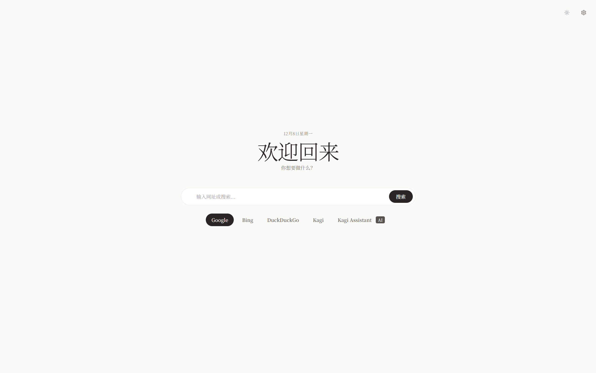
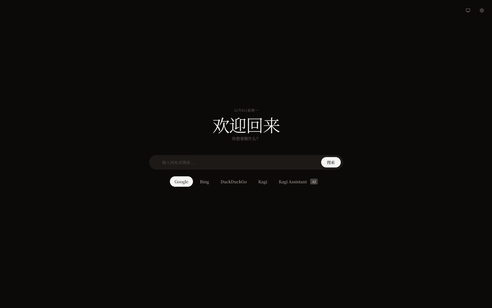

# Quick Tab Navigator

A smart new-tab start page and popup for quick navigation. It autocompletes from your browsing history and bookmarks for fast search and URL entry.

Features
- New Tab override and toolbar popup
- Autocomplete from history and bookmarks with inline completion
- URL detection and direct navigation
- Configurable search engines (add, reorder, set default, enable/disable, delete)
- Kagi Assistant AI integration (a boon for Kagi users)
- Keyboard shortcuts: Alt + 1..9 to switch engines (hold Alt to show hints)
- Quick Links (add/edit/reorder/enable/disable) with auto title and favicon
- Light/Dark/System theme
- Import/Export settings (JSON), Reset
- WebDAV cloud backup and restore

---

# Quick Tab Navigator

智能新标签页与弹窗，基于浏览历史和书签自动补全，快速搜索与导航。

功能
- 替换新标签页与工具栏弹窗
- 历史/书签联想与内联补全
- URL识别与直接跳转
- 可配置搜索引擎（添加/排序/设默认/启用禁用/删除）
- 集成 Kagi Assistant AI(利好Kagi用户)
- 键盘快捷键：Alt+1..9 切换引擎（按住 Alt 显示提示）
- 快速链接（添加/编辑/排序/启用禁用），自动标题与站点图标
- 主题：浅色/深色/跟随系统
- 设置导入/导出（JSON）、重置
- WebDAV 云备份与恢复

